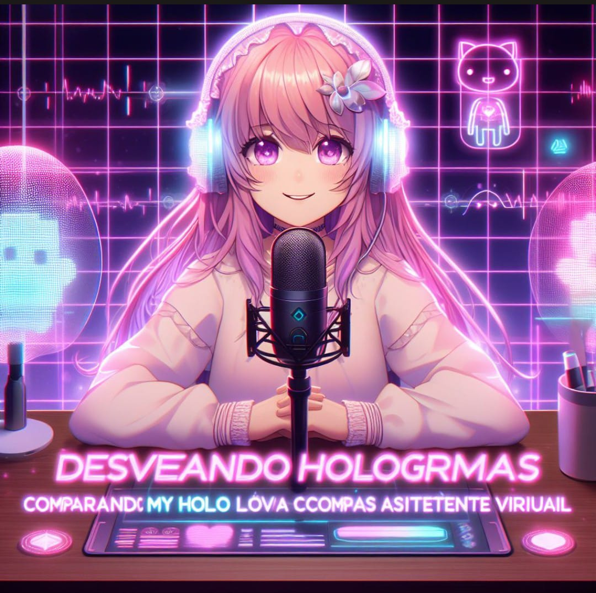
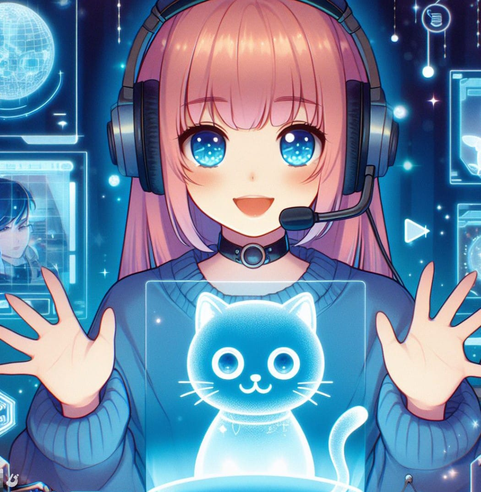
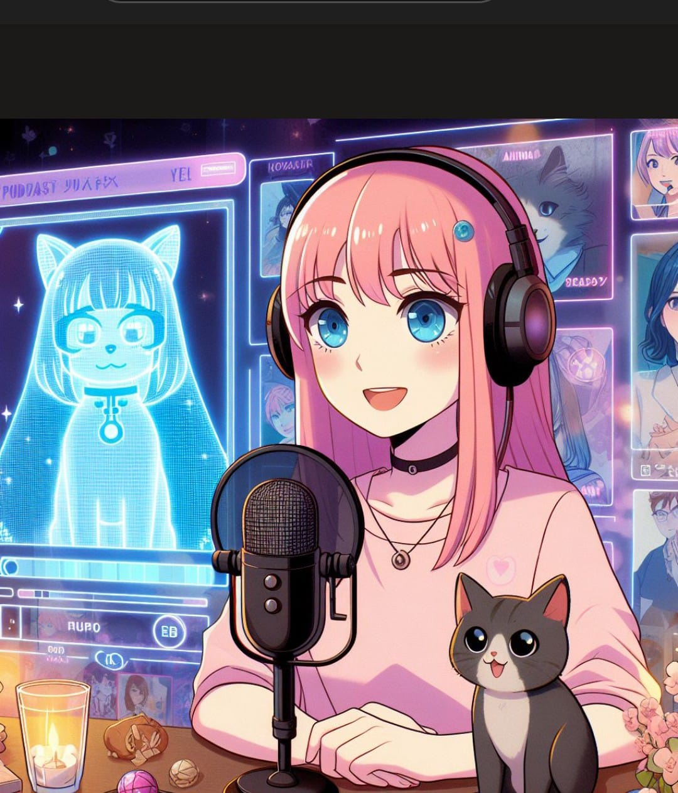
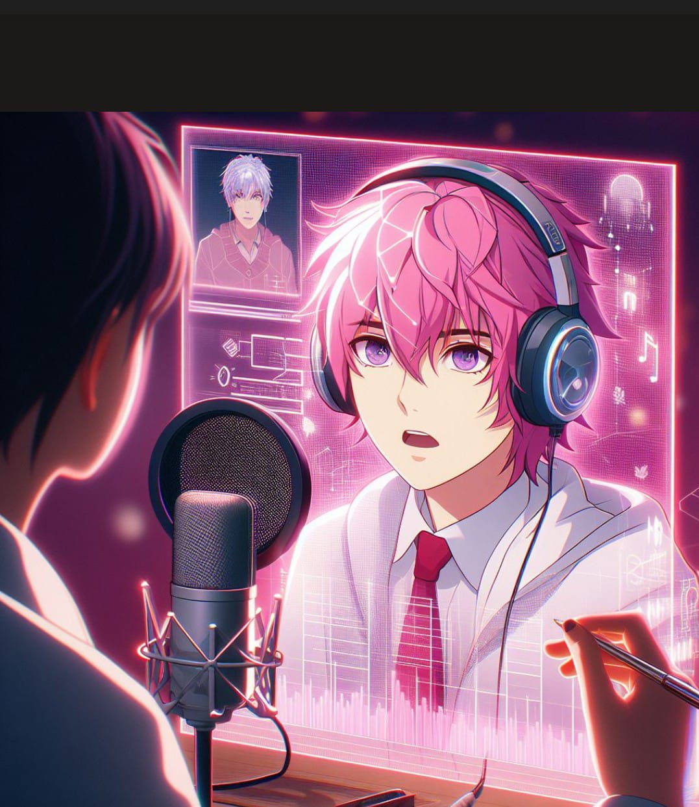

  

    
    
    
    
  

<h1 align="center">Igeek Podcast Desvendando Hologramas</h1>

  
  

  <a href="https://rosanatsf.notion.site/Podcast-Desvendando-Hologramas-b61fb4410b2f4e30bf14d5c784a1806c#14522f363c0047d184f6d55281e8da8f" target="_blank" rel="noopener noreferrer">
    Acesse o podcast no Notion
  </a>

## Sobre o Projeto

Projeto com o objetivo de criar um podcast utilizando ferramentas de IA para facilitar o processo criativo.

## 💻 Tecnologias Utilizadas

- [ChatGPT](https://chat.openai.com/) 
- [ElevenLabs](https://beta.elevenlabs.io/)
- [Capcut](https://www.capcut.com/pt-br/)

## ✨ Como Foi Feito ?

- Roteiro gerado via ChatGPT
- Áudio gerado pela ElevenLabs
- Copilot para gerar capas
- Capcut para edição de áudio e adição de sons de fundo

##

  

##
